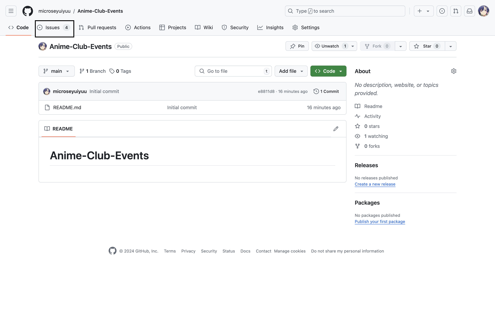
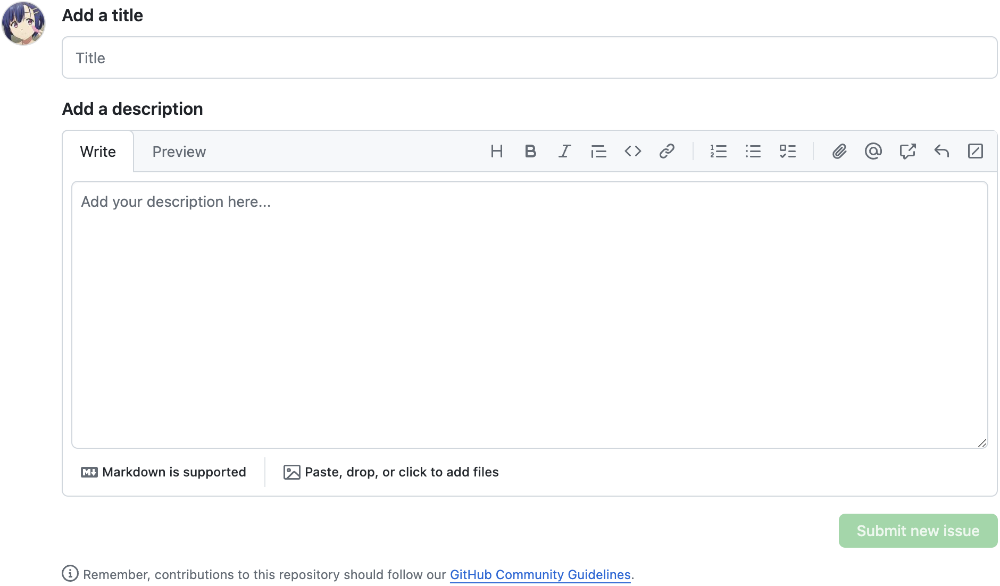
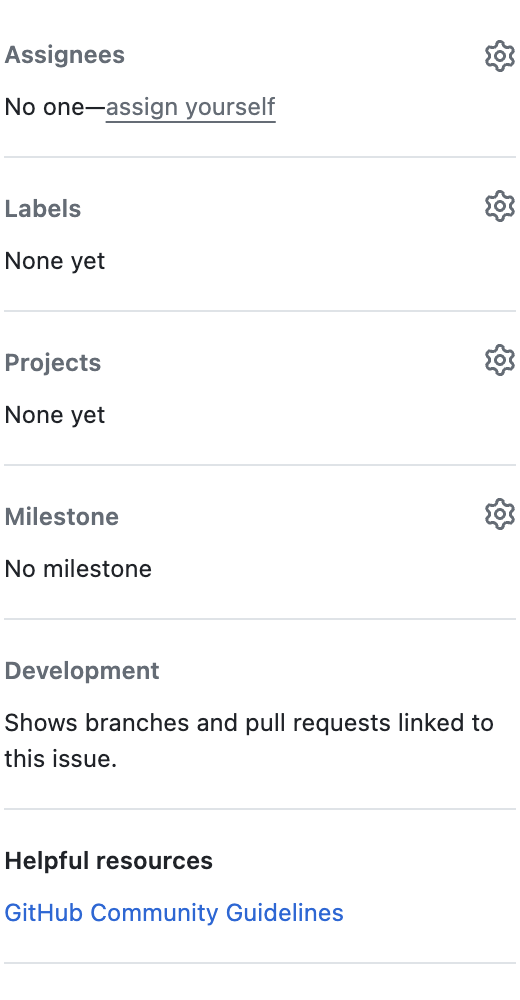
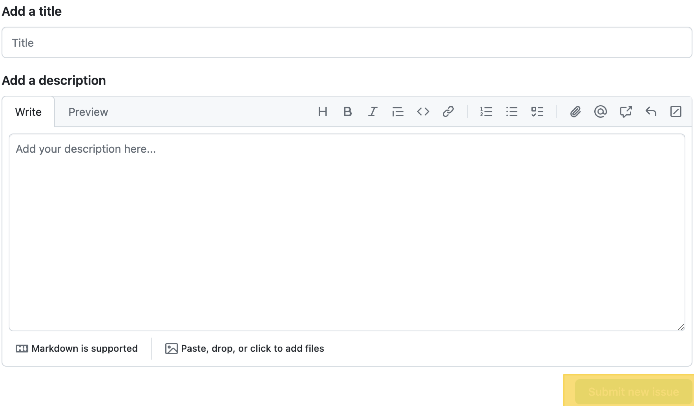

# 將任務添加至 Project 中

## 前置準備

- 確保已經註冊 GitHub 帳戶
- 確保你的 GitHub 帳戶有對應 Project 的查看以及管理權

## issue 是什麼

> 在 GitHub 中，issue 是一個用於提想法的地方，比如說你發現了一個錯誤或者有更好的想法都可以打開一個 issue 讓倉庫的主人看到，有點類似於評論。
> 但是 issue 是可以關閉的，當你提的內容已經完成了之後（比如錯誤被解決，建議被採納等）就會把 issue 關閉，這時候會留下一個紀錄。打開中的 issue 也可以讓倉庫的主人看到接下來的工作要圍繞什麼開展。

首先，找到你要提 issue 的倉庫，下面以 活動 倉庫為例：

點擊圖中黑色方框中的 `issue` 字樣
進入 `issue` 介面後，下面這個區域中分為上下兩個部分：

- add a title -> 添加標題
- add a description -> 添加描述

這裡寫上你要開的 issue 的內容以及描述（描述不一定要馬上寫，可以開完之後再進行修改）。

在 `issue` 介面的右半部分，是給這該 issue 添加屬性的部分：

-  Assignees 負責人
-  label 標籤
-  Project 項目

>主要填寫以上三個部分
負責人的部分主要填寫該任務是由誰完成
標籤的部分是用於標記這個 issue 是屬於什麼內容，比如說是建議、想法等，可以自己新增標籤
項目的部分就是將這個 issue 關聯至一個項目，這樣就能在那個項目的看板上看到這個任務，讓任務更加的聚集以及可視化

## 打開 issue

填寫完 issue 後，點擊右下角橙色部分打開你的 issue，這時候就能在該倉庫中看到新增的 issue 了。